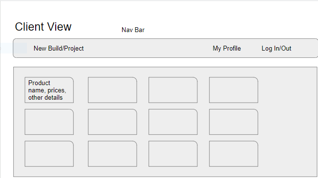
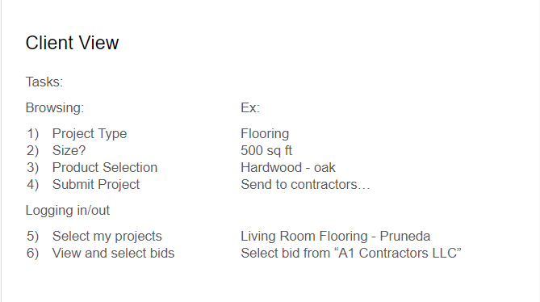
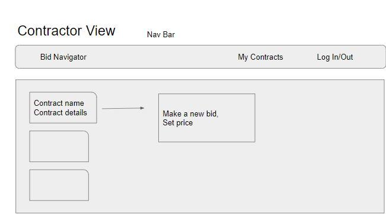
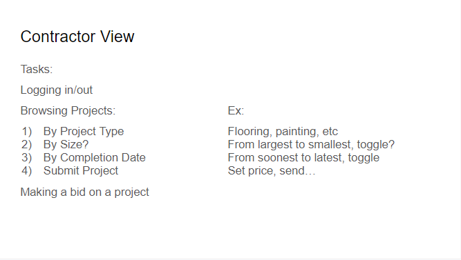

# Andrew's List

## Table of Contents

1.[Description and Purpose](#description)

2.[User Story](#userStory)

2.[Wireframes](#wireframes)

3.[Installation](#installation)

4.[Usage](#usage)

5.[Contribution](#contribution)

6.[Questions](#questions)

## Description

Andrew's List is a web application that serves as a home improvement marketplace. It allows clients to log in, browse available materials, create projects, and post those projects for contractors to see. Those contractors can then view open projects and submit bids based on the rendered materials list, cost of their labor, etc. The clients can then view the bids for the project and select a contractor.

The application is intended to reduce the amount of time both clients and contractors spend finding each other and planning projects.

## User Story

AS a Homeowner with home improvement aspirations
I WANT to be able to create a project, select products, and receive bids
SO THAT changes to my living space are completed.
AS a Contractor with business aspirations
I WANT to be presented with open projects and quickly create accurate bids
SO THAT I can complete projects for clients and grow my business.

## Wireframes

## Installation

You can find the deployed application at https://andrews-list.herokuapp.com/.

## Usage

You can use the application by opening a project for home improvement and selecting products that you would like use. Contractors will then offer bids for the job. If you would like to select a bid and start a project, reach out to the contractor via their email address.

## Contribution

You can contribute to this application by opening a pull request at github.com/AMess33/AndrewsList. Currently there are no rules or standards for contribution. Current contributers are Andrew Messer (github.com/AMess33), Eli Pruneda (github.com/Scorch87), and Alan Hornbaker (github.com/alanhornbaker).

## Questions

Known erros and other issues can be raised to the repository on github at github.com/AMess33/AndrewsList , or can be sent to the github profile at github.com/AMess33. As last resort, questions can be emailed to alanhornbaker@gmail.com.
